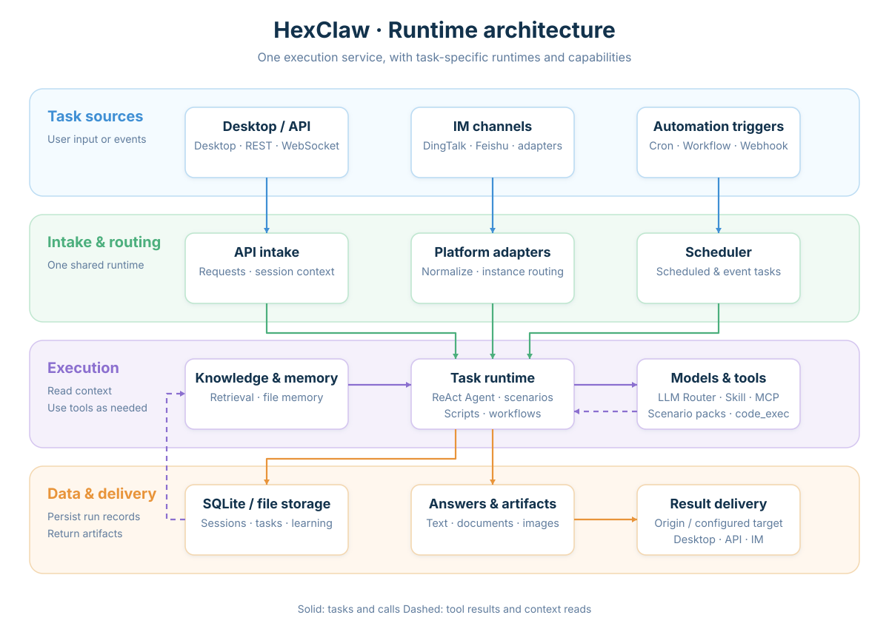
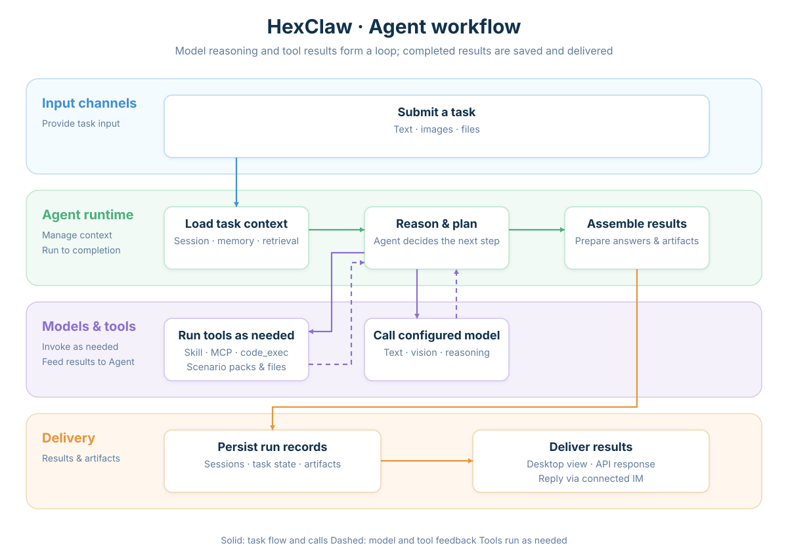

<div align="center">
  
  <h1>HexClaw</h1>
  <p><strong>A self-hosted personal AI Agent connecting conversations, tools, knowledge, and automation.</strong></p>

[](https://github.com/hexagon-codes/hexclaw/actions/workflows/ci.yml)
[](https://github.com/hexagon-codes/hexclaw/releases)
[](LICENSE)

[Quick start](#quick-start) · [First message](#send-your-first-message) · [API](docs/api.en.md) · [Website](https://hexclaw.net) · [Desktop](https://github.com/hexagon-codes/hexclaw-desktop) · [中文](README.md)

</div>

HexClaw is an Agent service written in Go. Run it independently, as the local Sidecar for HexClaw Desktop, or as a cloud backend. It brings model calls, tool execution, knowledge retrieval, long-term memory, and scheduled tasks into one service, accessible through Desktop, APIs, and messaging channels.

Beyond conversation, HexClaw can process files, generate documents and images, execute code, run workflows, and deliver results to configured channels. Models, tools, and scenario capabilities are connected through configuration, and data belongs to the backend in use.

> This README describes the current source. Published binaries, images, and desktop installers use the code and documentation of their selected Release and may differ from the current source.


This desktop-client example reuses the real interface and K12 skin from the [official K12 tutorial (Chinese)](https://hexclaw.net/zh/docs/k12). The tutorial covers Desktop `v0.5.0-beta.3` / HexClaw `v0.5.0-beta.1`; its screenshots retain the `v0.5.0-beta` scenario baseline. Homework material is an **AI-generated example, not real student work**.

## Contents

- [Quick start](#quick-start)
- [Core capabilities](#core-capabilities)
- [How it works](#how-it-works)
- [Configuration](#configuration)
- [APIs and extensions](#apis-and-extensions)
- [Development and contribution](#development-and-contribution)
- [Documentation and ecosystem](#documentation-and-ecosystem)
- [License](#license)

## Quick start

### Runtime requirements

| Usage | Prerequisites |
| --- | --- |
| Desktop client | Current macOS bundled components require macOS 14 or later; see [Desktop runtime requirements](https://github.com/hexagon-codes/hexclaw-desktop/blob/main/README.en.md#runtime-requirements) for Windows and Linux architectures and dependencies |
| Standalone binary | A [Release asset](https://github.com/hexagon-codes/hexclaw/releases) for your system and architecture; no Go toolchain required |
| Go installation or source build | Current source requires Go 1.25.13 or later; source builds also need Git and Make. For a release, use its tag's `go.mod` |
| Model tasks | An online Provider and credentials, or local Ollama with a downloaded model; image tasks also require the relevant vision capabilities |

Configure [optional runtime dependencies](#optional-runtime-dependencies) for document rendering, code execution, and media generation as needed.

### Install the desktop client

For a graphical desktop experience, macOS users can install [HexClaw Desktop](https://github.com/hexagon-codes/hexclaw-desktop) with the **one-line install (recommended)**:

```bash
curl -fsSL https://raw.githubusercontent.com/hexagon-codes/hexclaw-desktop/bb3c12ec91eec91798b67c292bc8c85c4481dc2b/install.sh | bash
```

This installs **HexClaw Desktop**, which manages its local Sidecar and also supports a cloud backend. See [Desktop installation](https://github.com/hexagon-codes/hexclaw-desktop/blob/main/README.en.md#installation) for Windows and Linux packages and first-use setup. To run the standalone Go service, use one of the following service installation paths.

### Install a published service version

Download the binary for your system and architecture from [Releases](https://github.com/hexagon-codes/hexclaw/releases), or install it with Go:

```bash
go install github.com/hexagon-codes/hexclaw/cmd/hexclaw@latest

export DEEPSEEK_API_KEY="your API key"
hexclaw serve
```

Ensure the Go installation directory is on your `PATH`: `GOBIN` when configured, or `$(go env GOPATH)/bin` by default.

`@latest` selects the stable version. For a prerelease, specify a version Tag that actually exists in Releases.

### Run the latest source

Build the current mainline:

```bash
git clone https://github.com/hexagon-codes/hexclaw.git
cd hexclaw
make build

export DEEPSEEK_API_KEY="your API key"
./bin/hexclaw serve
```

Environment variables also support `OPENAI_API_KEY`, `ANTHROPIC_API_KEY`, `QWEN_API_KEY`, and `GEMINI_API_KEY`. Use a [configuration file](#configuration) to connect a custom service or local Ollama.

The default address is `http://127.0.0.1:16060`, with configuration and data under `~/.hexclaw/`. The service can start without a configured model; chat, image processing, and other model-dependent tasks require an available Provider for the relevant purpose.

### Send your first message

`hexclaw init` generates and persists the business API token. Starting the standalone service directly also fills a missing `server.api_token` in its configuration file, preserving an existing value. In another terminal, set that value in the environment variable used by this example:

```bash
export HEXCLAW_API_TOKEN="server.api_token from your configuration file"

curl --fail-with-body http://127.0.0.1:16060/api/v1/chat \
  -H "Authorization: Bearer ${HEXCLAW_API_TOKEN}" \
  -H "Content-Type: application/json" \
  -d '{"message":"Hello, tell me what you can do"}'
```

Success is `200 application/json`, including a reply and session ID. This example shows the main fields; the model determines the reply text:

```json
{
  "reply": "A model-generated response",
  "session_id": "The session ID returned by the service"
}
```

Receiving a complete reply means this text conversation has completed; a health check only proves the service is running. Substitute the actual `session_id` in your next request to continue the conversation:

```bash
curl --fail-with-body http://127.0.0.1:16060/api/v1/chat \
  -H "Authorization: Bearer ${HEXCLAW_API_TOKEN}" \
  -H "Content-Type: application/json" \
  -d '{"message":"Continue our previous topic","session_id":"session_id from the previous response"}'
```

See the [chat API](docs/api.en.md#chat) for attachments, structured outputs, and SSE completion.

| Common issue | Where to check |
| --- | --- |
| Cannot connect, or the port is in use | [Startup troubleshooting](docs/install.en.md#startup-failures): check the process and listening address |
| Response is `401` | [Connection and identity](docs/api.en.md#connection-and-identity): use the active service's token |
| Model call failed or reply did not complete | [Model configuration](docs/install.en.md#configuration) and [chat failures](docs/api.en.md#errors): check the Provider, model, and actual error |

For a graphical interface, install [HexClaw Desktop](https://github.com/hexagon-codes/hexclaw-desktop). Desktop manages its local Sidecar and connection, and can also connect to a cloud backend.

### Docker deployment

Build and start from the source directory:

```bash
docker compose build hexclaw
docker compose up -d hexclaw
```

The default Compose setup uses the local `hexclaw:dev` image and persists the complete writable HOME in the `hexclaw-data` volume. The current image targets Linux amd64 and includes document-rendering tools, Chinese fonts, and Python/SymPy dependencies. It does not install Ollama or download models by default.

For published images, model and API token configuration, HTTPS, Kubernetes, backups, and updates, see the [cloud deployment guide](docs/cloud-deployment.md).

## Core capabilities

| Capability | What you can do |
| --- | --- |
| Multiple model providers | Connect DeepSeek, OpenAI, Anthropic, Qwen, Gemini, Ollama, and OpenAI-compatible services; select models for text, vision, reasoning, and Embedding |
| Agent runtime | ReAct tool loops, streaming replies, tool-call records, and runtime events; planning and reflection prompt strategies, Agent routing, and team collaboration |
| Tools and extensions | Use built-in search, browser, file processing, and sandboxed code execution; connect MCP servers, install Markdown Skills, and extend plugins and scenario packs |
| Knowledge base | Ingest documents, PDFs, and images; combine full-text and vector retrieval; track asynchronous jobs, progress, checkpoints, and recovery states |
| Sessions and memory | Persist conversations, search messages, fork sessions, compact context, and maintain file-based long-term memory |
| Automation | Schedule Cron and Heartbeat tasks, receive Webhooks, and run multi-step workflows; reuse Agents, tools, and result delivery |
| Actual outputs | Export documents, generate images and videos, collect code-execution artifacts, and deliver attachments; use resulting files in downloads and subsequent tasks |
| Primary-school tutoring | Solve and grade homework images, review writing and artwork, revisit mistakes, generate weekly practice, maintain learner profiles, and use real textbook catalogs and curriculum progress suggestions |

### Use your existing entry points

- **Desktop and APIs**: HexClaw Desktop, HTTP API, and WebSocket.
- **Messaging channels**: Feishu, DingTalk, Telegram, Discord, Slack, WeCom, WeChat Official Account, WhatsApp, LINE, Matrix, and Email.
- **Automatic triggers**: Scheduled tasks, Webhooks, Heartbeat, and workflows.

DingTalk primarily receives messages through the official Stream SDK, without requiring a public callback address. An HTTP Webhook compatibility path is also available. Transport and presentation capabilities differ by channel; see the [installation guide](docs/install.en.md#platform-integration) for configuration.

### Built-in K12 scenario

K12 currently serves primary-school learners, covering mathematics, Chinese, English, science, information technology, and art. Parents can send images through Desktop or a configured DingTalk channel. Both use the same domain tasks to process completed homework, blank questions, writing, and artwork.

Homework-image grading primarily returns the original image with annotations. Content that cannot be read reliably is marked “无法识别” (“unreadable”), while readable portions continue processing. Provider failures are recorded separately from unreadable content. Mistakes, review evidence, and weekly practice belong to the current child's profile and task records.

Textbook features extract catalogs and cover evidence from actual uploaded textbooks, supporting math textbook bindings and AI curriculum progress suggestions. Suggestions provide context for subsequent tasks; they do not prove that a child has studied or mastered the material. Estimates never overwrite manually confirmed progress in the same scope. Real questions can still be processed without a usable textbook or curriculum progress.

## How it works

### Entry points, runtimes, and data

Entry points connect to one execution service, which uses ReAct Agents, scenario tasks, scripts, or workflows according to the task. Models, tools, memory, and knowledge participate as needed. Interactive tasks reply through their original entry point; automated tasks deliver results to configured destinations.



### How an Agent task completes

The runtime loads the session and relevant context, calls a model for reasoning, executes tools when needed, and feeds their results back to the model. It then persists the conversation and runtime records, returning the answer and actual outputs.



Download diagrams: [Architecture PNG](.github/assets/hexclaw-architecture.en.png) · [Agent workflow PNG](.github/assets/hexclaw-agent-workflow.en.png).

## Configuration

The default configuration file is `~/.hexclaw/hexclaw.yaml`. Generate a template on first use:

```bash
hexclaw init
hexclaw serve --config ~/.hexclaw/hexclaw.yaml
```

If configuration already exists, edit it and start the service directly. When the configuration file loads, `${VAR_NAME}` is expanded from the current process environment; unset variables become empty values. A minimal cloud model configuration:

```yaml
server:
  host: 127.0.0.1
  port: 16060

llm:
  default: deepseek
  providers:
    deepseek:
      api_key: ${DEEPSEEK_API_KEY}
      model: deepseek-chat

storage:
  driver: sqlite
  sqlite:
    path: ~/.hexclaw/data.db
```

The standalone service generates a persistent token when `server.api_token` is missing. A custom OpenAI-compatible Provider can set `base_url` and `compatible: openai`. See the [installation and configuration guide](docs/install.en.md#configuration), [configuration types](config/config.go), and [default template](config/loader.go) for Ollama, vision models, Embedding, and other options.

| Configuration area | Keys |
| --- | --- |
| Models and routing by purpose | `llm`, `ollama` |
| Messaging platforms and Agent routing | `platforms`, `router` |
| Tools, skill marketplace, and MCP | `skill`, `skills`, `mcp` |
| Knowledge, memory, and context | `knowledge`, `file_memory`, `memory`, `compaction` |
| Scheduled and event triggers | `cron`, `heartbeat`, `webhook` |
| Authentication, budgets, permissions, and audit | `security`, `budget`, `audit` |
| Scenarios and feature flags | `k12`, `features` |

The service handles authentication, rate limits, cost checks, input processing, permissions, and auditing. Unattended tasks default to `security.autonomy.profile: function_first`; Profiles, per-source overrides, and tool permission policies determine what can execute automatically. Consult the [security notes](SECURITY.md) and [configuration types](config/config.go) when configuring your tasks.

### Optional runtime dependencies

| Capability | Dependencies |
| --- | --- |
| Text conversations | An available text-model Provider |
| Image understanding and homework images | An available vision model and the scenario's required reasoning model |
| Vector retrieval | A configured Embedding service; keyword retrieval availability is evaluated separately |
| Document export and PDF/math rendering | Pandoc, Typst, and the relevant fonts |
| Question calculation and code execution | Python/SymPy or the relevant language runtime, plus an available sandbox backend |
| Media generation and message delivery | The relevant media Provider and configured destination channels |

## APIs and extensions

Business APIs use Bearer tokens. `GET /health` is public and needs no token; a healthy response does not establish availability of the selected model and task flow. Common entry points are listed below; availability depends on the corresponding modules and dependencies.

| Entry point | Purpose |
| --- | --- |
| `GET /health` | Service health and process information |
| `POST /api/v1/chat` | Conversations, attachments, and streaming replies |
| `/api/v1/sessions` | Sessions, history, search, and forks |
| `/api/v1/config/llm` | Provider configuration, connection tests, and model discovery |
| `/api/v1/knowledge` | Documents, retrieval, ingestion jobs, and recovery |
| `POST /api/v1/render` | Markdown document rendering |
| `POST /api/v1/cronjob` | Unified scheduled-task operations |
| `/api/v1/agents` | Agents and routing rules |
| `/api/v1/mcp`, `/api/v1/skills` | MCP servers, tools, and skills |
| `/api/k12` | Primary-school tutoring APIs |

See the [public API guide](docs/api.en.md) for complete module references, examples, responses, and failures, and [OpenAPI](api/openapi.yaml) for the machine-readable description. Native internal bridging, conditional routes, and compatibility endpoints have explicit scope notes. The [API server](api/server.go) is an implementation reference. For K12 integration, use the [scenario API](scenarios/k12/API.en.md):

- [Profile bundle updates](scenarios/k12/API.en.md#profile-bundle): transactional textbook, progress, and binding updates, revision conflicts, and idempotency inputs.
- [Textbooks and curriculum progress](scenarios/k12/API.en.md#textbook-and-curriculum-progress): omission versus `null`, confirmed progress precedence, read-only previews, and CAS adoption.
- [Image task completion](scenarios/k12/API.en.md#image-task-completion): automatic progression, unreadable content versus technical failures, and delivery of the annotated original image.

### Choose an extension mechanism

| Extension | When to use it | Entry point |
| --- | --- | --- |
| Markdown Skill | Add installable task instructions and skills | [HexClaw Hub](https://github.com/hexagon-codes/hexclaw-hub) |
| MCP Server | Connect external tools and resources | [MCP management](mcp) |
| Plugin | Extend application Skills, Adapters, Hooks, and other capabilities | [Plugin development guide](docs/plugin-dev.en.md) |
| Scenario pack | Inject domain records, constraints, views, and Agent strategies | [Scenario contract](scenario/manifest.go), [K12 example](scenarios/k12) |

Use `code_exec` for code tasks, with execution information and artifact manifests. Legacy host tools `code` and `shell` remain compatible with explicit configuration and are disabled by default.

## Development and contribution

```bash
make build    # Build bin/hexclaw
make run      # Build and start the development service
make fmt      # Format code
make vet      # Run static checks
make test     # Run existing tests
```

Main modules:

| Module | Responsibility |
| --- | --- |
| `cmd/hexclaw`, `api`, `adapter` | CLI, HTTP service, and message ingestion |
| `engine`, `llmrouter`, `agents`, `router` | Reasoning loops, model selection, and Agent collaboration |
| `skill`, `mcp`, `plugin`, `scenario` | Tools and extension mechanisms |
| `knowledge`, `memory`, `storage`, `records` | Retrieval, long-term memory, and persistence |
| `cron`, `webhook`, `canvas`, `render` | Automation, workflows, and artifact rendering |
| `scenarios/k12` | Primary-school tutoring tasks and data |

Read [CONTRIBUTING.md](CONTRIBUTING.md) before contributing; it maintains development conventions, validation scope, and the fixed CI/CD baseline. Report issues and discuss features through [GitHub Issues](https://github.com/hexagon-codes/hexclaw/issues). Report security issues as described in [SECURITY.md](SECURITY.md).

## Documentation and ecosystem

| Resource | Description |
| --- | --- |
| [Website](https://hexclaw.net) | Product overview and desktop installation |
| [Official documentation](https://hexclaw.net/en/docs/) | Product guides and documentation |
| [Installation and deployment](docs/install.en.md) | System requirements, configuration, channels, and operations |
| [Cloud deployment](docs/cloud-deployment.md) | Compose, HTTPS, Kubernetes, backups, and updates |
| [Public API](docs/api.en.md) / [K12 API](scenarios/k12/API.en.md) | Request examples, responses, failures, and scenario integration contracts |
| [Plugin development](docs/plugin-dev.en.md) | Plugin interfaces, Manifests, and lifecycle |
| [Changelog](CHANGELOG.md) | Version changes |

The HexClaw ecosystem spans general libraries, model integration, and Agent orchestration, through to the service, desktop workspace, and skill marketplace:

| Project | Role and capabilities | Technology |
| --- | --- | --- |
| [toolkit](https://github.com/hexagon-codes/toolkit) | General Go library: generic collections, concurrency, HTTP/SSE, caching and configuration, logging, databases, object storage, and command sandboxing | Go |
| [ai-core](https://github.com/hexagon-codes/ai-core) | AI foundation: unified model integration, tool calling, streaming and structured output, model routing, Embedding, and image, video, and speech capabilities | Go |
| [Hexagon](https://github.com/hexagon-codes/hexagon) | AI Agent framework: tool calling, graph orchestration, multiple Agents, RAG, durable execution, and MCP, A2A, and OpenTelemetry integration | Go |
| [HexClaw](https://github.com/hexagon-codes/hexclaw) (this repository) | Self-hostable AI Agent service: multiple models, tools, knowledge bases, long-term memory, and task automation, with API and multi-platform IM access | Go |
| [HexClaw Desktop](https://github.com/hexagon-codes/hexclaw-desktop) | AI Agent desktop workspace: connects to local or cloud HexClaw services and brings together chat, knowledge bases, tools, task automation, and K12 homework tutoring | Tauri 2, Vue 3, TypeScript, Rust |
| [HexClaw Hub](https://github.com/hexagon-codes/hexclaw-hub) | Skill and tool marketplace: Markdown skill definitions, MCP server directory, marketplace index, and generation and validation tools | Markdown, Python |

## License

HexClaw is licensed under the [Apache License 2.0](LICENSE).
