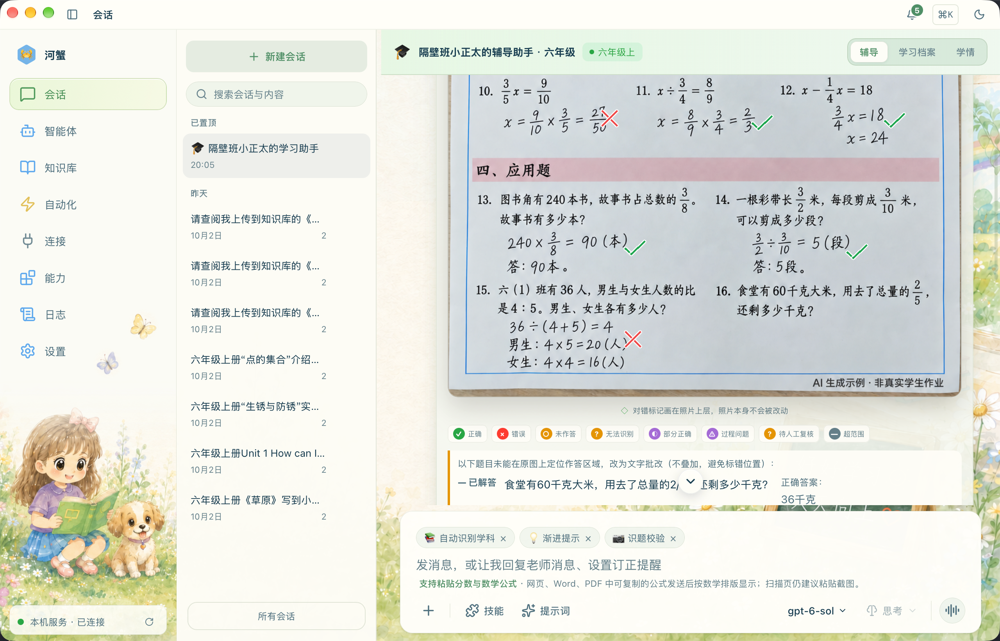
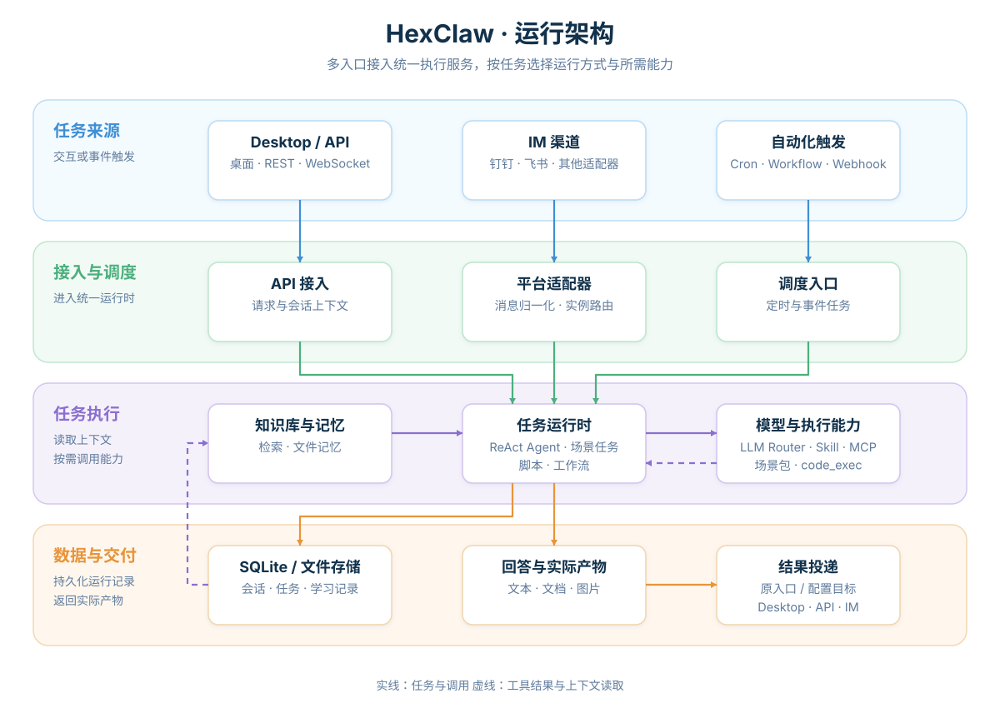
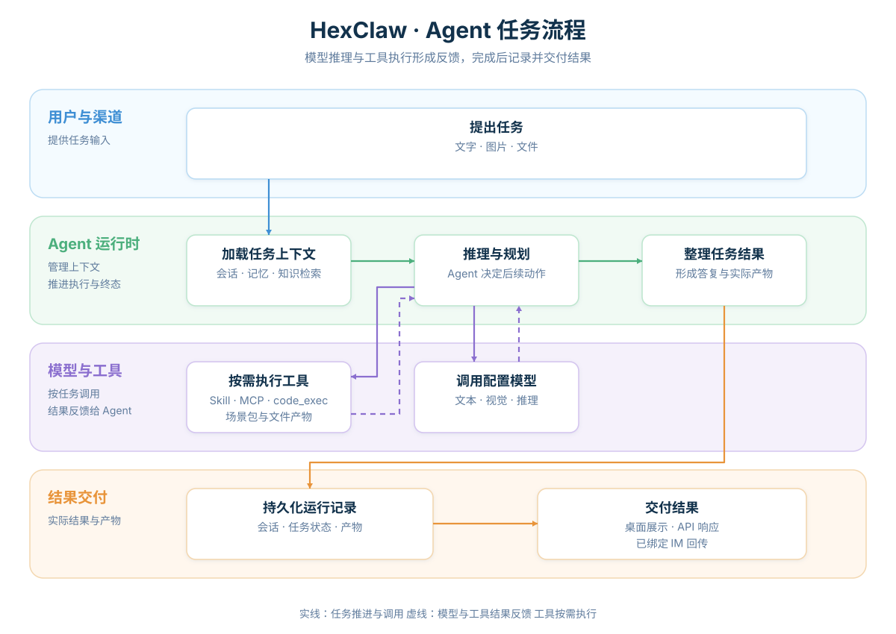

<div align="center">
  
  <h1>HexClaw 河蟹</h1>
  <p><strong>可自托管的个人 AI Agent，让对话连接工具、知识和自动化。</strong></p>

[](https://github.com/hexagon-codes/hexclaw/actions/workflows/ci.yml)
[](https://github.com/hexagon-codes/hexclaw/releases)
[](LICENSE)

[快速开始](#快速开始) · [第一条消息](#发送第一条消息) · [API](docs/api.md) · [官网](https://hexclaw.net) · [桌面客户端](https://github.com/hexagon-codes/hexclaw-desktop) · [English](README.en.md)

</div>

HexClaw 是用 Go 编写的 Agent 服务，可独立运行，也可作为 HexClaw Desktop 的本地 Sidecar 或云端后端。它把模型调用、工具执行、知识检索、长期记忆和定时任务集成到同一服务中，通过桌面客户端、API 和消息渠道使用。

对话之外，HexClaw 可以处理文件、生成文档和图片、执行代码、运行工作流，并把结果送到已配置的渠道。模型、工具和场景能力按配置接入，数据保存在当前使用的后端。

> 本 README 描述当前源码能力。已发布二进制、镜像与桌面安装包以所选 Release 的代码和文档为准，可能与当前源码存在差异。



上图展示 HexClaw 在桌面客户端中的作业辅导场景，复用[官方 K12 教程](https://hexclaw.net/zh/docs/k12)的真实界面与专属皮肤。教程适用 Desktop `v0.5.0-beta.3` / HexClaw `v0.5.0-beta.1`，截图沿用 `v0.5.0-beta` 场景基线；作业素材为 **AI 生成示例 · 非真实学生作业**。

## 目录

- [快速开始](#快速开始)
- [核心能力](#核心能力)
- [工作原理](#工作原理)
- [配置](#配置)
- [API 与扩展](#api-与扩展)
- [开发与贡献](#开发与贡献)
- [文档与生态](#文档与生态)
- [许可证](#许可证)

## 快速开始

### 运行要求

| 使用方式 | 前提 |
| --- | --- |
| 桌面客户端 | 当前 macOS 随包组件需要 macOS 14 及以上；Windows、Linux 架构与依赖见 [Desktop 运行要求](https://github.com/hexagon-codes/hexclaw-desktop#运行要求) |
| 独立二进制 | 对应系统与架构的 [Release 资产](https://github.com/hexagon-codes/hexclaw/releases)，无需 Go 工具链 |
| Go 安装或源码构建 | 当前源码需要 Go 1.25.13 及以上；源码构建另需 Git、Make，发布版本以该 tag 的 `go.mod` 为准 |
| 模型任务 | 可用的在线 Provider 与凭据，或本地 Ollama 与已下载模型；图片任务另需对应视觉能力 |

文档渲染、代码执行和媒体生成按需配置[可选运行依赖](#可选运行依赖)。

### 安装桌面客户端

通过 [HexClaw Desktop](https://github.com/hexagon-codes/hexclaw-desktop) 使用本机 HexClaw 服务时，macOS 用户可使用**一键安装（推荐）**：

```bash
curl -fsSL https://raw.githubusercontent.com/hexagon-codes/hexclaw-desktop/bb3c12ec91eec91798b67c292bc8c85c4481dc2b/install.sh | bash
```

该命令安装桌面客户端及其本地 Sidecar。Windows、Linux 安装包与首次配置见 [Desktop 安装说明](https://github.com/hexagon-codes/hexclaw-desktop#安装)。独立部署 Agent 服务使用下面的 Go、二进制或容器方式。

### 安装独立服务

从 [Releases](https://github.com/hexagon-codes/hexclaw/releases) 下载与你的系统和架构对应的二进制；开发者也可以使用 Go 安装：

```bash
go install github.com/hexagon-codes/hexclaw/cmd/hexclaw@latest

export DEEPSEEK_API_KEY="你的 API Key"
hexclaw serve
```

`@latest` 选择稳定版。使用预发布版时，指定 Releases 中实际存在的版本 Tag。

使用 `go install` 时，确保 `GOBIN`（默认 `$(go env GOPATH)/bin`）位于 `PATH`，才能直接运行 `hexclaw`。

### 运行最新源码

以下命令构建当前主线代码：

```bash
git clone https://github.com/hexagon-codes/hexclaw.git
cd hexclaw
make build

export DEEPSEEK_API_KEY="你的 API Key"
./bin/hexclaw serve
```

也支持 `OPENAI_API_KEY`、`ANTHROPIC_API_KEY`、`QWEN_API_KEY` 和 `GEMINI_API_KEY`。自定义服务或本地 Ollama 使用[配置文件](#配置)接入。

默认地址为 `http://127.0.0.1:16060`，配置和数据位于 `~/.hexclaw/`。服务可以在未配置模型时启动；聊天、图片处理和其他模型任务需要对应用途的可用 Provider。

### 发送第一条消息

`hexclaw init` 会生成并保存业务 API 令牌；直接启动独立服务时，也会为缺少令牌的配置补齐 `server.api_token`，已有值保持不变。在另一个终端，将该值设置为下面示例使用的环境变量：

```bash
export HEXCLAW_API_TOKEN="配置文件中的 server.api_token"

curl --fail-with-body http://127.0.0.1:16060/api/v1/chat \
  -H "Authorization: Bearer ${HEXCLAW_API_TOKEN}" \
  -H "Content-Type: application/json" \
  -d '{"message":"你好，介绍一下你能做什么"}'
```

成功响应为 `200 application/json`，包含回答与会话 ID。下面仅示意主要字段，回复文本由模型决定：

```json
{
  "reply": "模型生成的回答",
  "session_id": "服务返回的会话 ID"
}
```

收到完整回答说明该次文本对话已完成；健康检查通过只说明服务运行。将实际返回的 `session_id` 代入下一次请求，继续同一会话：

```bash
curl --fail-with-body http://127.0.0.1:16060/api/v1/chat \
  -H "Authorization: Bearer ${HEXCLAW_API_TOKEN}" \
  -H "Content-Type: application/json" \
  -d '{"message":"继续刚才的话题","session_id":"上次响应的 session_id"}'
```

附件、结构化产物和 SSE 终态见[聊天 API](docs/api.md#chat)。

| 常见问题 | 检查入口 |
| --- | --- |
| 无法连接服务或端口被占用 | [启动排查](docs/install.md#启动失败)，核对进程和监听地址 |
| 返回 `401` | [连接与身份](docs/api.md#连接与身份)，使用当前服务配置中的令牌 |
| 模型调用失败或回答未完成 | [模型配置](docs/install.md#配置)与[聊天失败响应](docs/api.md#失败响应)，核对 Provider、模型和实际错误 |

希望通过图形界面使用，安装 [HexClaw Desktop](https://github.com/hexagon-codes/hexclaw-desktop)。Desktop 管理本地 Sidecar 的启动和连接，也支持配置云端后端。

### Docker 部署

在源码目录构建并启动：

```bash
docker compose build hexclaw
docker compose up -d hexclaw
```

默认 Compose 使用本地 `hexclaw:dev` 镜像，把完整可写 HOME 持久化到 `hexclaw-data` 卷。当前镜像面向 Linux amd64，包含文档渲染、中文字体和 Python/SymPy 依赖；默认不安装 Ollama 或下载模型。

使用已发布镜像、设置模型和 API 令牌，以及 HTTPS、Kubernetes、备份和更新，见[云端部署指南](docs/cloud-deployment.md)。

## 核心能力

| 能力 | 可以做什么 |
| --- | --- |
| 多模型接入 | 接入 DeepSeek、OpenAI、Anthropic、通义千问、Gemini、Ollama 和 OpenAI 兼容服务；按文本、视觉、推理、Embedding 等用途选择模型 |
| Agent 运行时 | ReAct 工具循环、流式回复、工具调用记录和运行事件；支持规划执行、反思等提示策略，以及 Agent 路由与团队协作 |
| 工具与扩展 | 内置搜索、浏览器、文件处理、沙箱代码执行等工具；连接 MCP Server，安装 Markdown Skill，扩展插件与场景包 |
| 知识库 | 文档、PDF 和图片摄取；全文与向量混合检索；异步任务、进度、检查点和恢复状态 |
| 会话与记忆 | 持久化会话、消息搜索、会话分支、上下文压缩，以及文件驱动的长期记忆 |
| 自动化 | Cron、Heartbeat、Webhook 和多步骤工作流；复用 Agent、工具和结果投递能力 |
| 实际产物 | 文档导出、图片与视频生成、代码执行产物和附件投递；结果文件可供下载与后续任务使用 |
| 小学辅导场景 | 图片解题与批改、作文与美术点评、错题复习、周练、学情档案，以及真实教材目录和课程进度建议 |

### 从你已有的入口使用

- **桌面与 API**：HexClaw Desktop、HTTP API、WebSocket。
- **消息渠道**：飞书、钉钉、Telegram、Discord、Slack、企业微信、微信公众号、WhatsApp、LINE、Matrix、Email。
- **自动触发**：定时任务、Webhook、Heartbeat、工作流。

钉钉主要通过官方 Stream SDK 接收消息，无需为接入配置公网回调地址；同时保留 HTTP Webhook 兼容路径。各渠道的传输和展示能力不同，具体配置见[安装指南](docs/install.md#平台接入)。

### 内置 K12 场景

K12 当前面向小学，覆盖数学、语文、英语、科学、信息科技和美术。家长可以在 Desktop 或已绑定的钉钉渠道发图，由同一领域任务处理作业、空白题、作文或美术作品。

图片作业批改以带批注的原图为主要结果。无法可靠辨认的内容标注“无法识别”，可识别部分继续处理；Provider 调用失败和内容无法识别分别记录。错题、复习与周练关联当前孩子的档案和任务记录。

教材能力基于真实上传教材提取目录和封面证据，支持数学教材绑定与 AI 课程进度建议。建议用于后续任务的上下文，不代表孩子已经学过或掌握；人工确认的进度不会被同范围推算覆盖。没有可用教材或课程进度时，仍可处理实际题目。

## 工作原理

### 入口、运行时与数据

各入口进入统一执行服务，按任务使用 ReAct Agent、场景任务、脚本或工作流。模型、工具、记忆与知识库按需参与；交互任务经原入口回复，自动化任务向已配置的目标投递结果。



### 一次 Agent 任务如何完成

运行时加载会话和相关上下文，调用模型推理，按需执行工具，并把工具结果交回模型。完成后保存会话与运行记录，返回回答和实际产物。



图示下载：[架构 PNG](.github/assets/hexclaw-architecture.png) · [任务流程 PNG](.github/assets/hexclaw-agent-workflow.png)。

## 配置

默认配置文件为 `~/.hexclaw/hexclaw.yaml`。首次使用可以生成配置模板：

```bash
hexclaw init
hexclaw serve --config ~/.hexclaw/hexclaw.yaml
```

已有配置时直接编辑并启动。配置文件加载时，`${VAR_NAME}` 按当前进程环境展开，未设置的变量为空值。一个最小的云端模型配置如下：

```yaml
server:
  host: 127.0.0.1
  port: 16060

llm:
  default: deepseek
  providers:
    deepseek:
      api_key: ${DEEPSEEK_API_KEY}
      model: deepseek-chat

storage:
  driver: sqlite
  sqlite:
    path: ~/.hexclaw/data.db
```

独立服务会为缺少 `server.api_token` 的配置生成持久令牌。自定义 OpenAI 兼容服务可在 Provider 下设置 `base_url` 与 `compatible: openai`；Ollama、视觉模型、Embedding 和其他选项见[安装与配置指南](docs/install.md#配置)、[配置结构](config/config.go)和[默认配置模板](config/loader.go)。

| 配置范围 | 配置入口 |
| --- | --- |
| 模型与用途路由 | `llm`、`ollama` |
| 消息平台与多 Agent 路由 | `platforms`、`router` |
| 工具、技能市场与 MCP | `skill`、`skills`、`mcp` |
| 知识、记忆与上下文 | `knowledge`、`file_memory`、`memory`、`compaction` |
| 定时与事件触发 | `cron`、`heartbeat`、`webhook` |
| 认证、预算、权限和审计 | `security`、`budget`、`audit` |
| 场景与功能开关 | `k12`、`features` |

认证、限流、成本检查、输入处理、权限和审计由服务侧统一执行。无人值守默认使用 `security.autonomy.profile: function_first`，具体自动执行范围由 Profile、来源覆盖配置和工具权限策略决定；查看[安全说明](SECURITY.md)与[配置定义](config/config.go)，按实际任务调整。

### 可选运行依赖

| 能力 | 需要的依赖 |
| --- | --- |
| 普通文本对话 | 可用文本模型 Provider |
| 图片理解与作业图片处理 | 可用视觉模型及场景所需推理模型 |
| 向量检索 | 已配置的 Embedding 服务；关键词检索状态独立判断 |
| 文档导出与 PDF/数学渲染 | Pandoc、Typst 和相应字体 |
| 题目计算与代码执行 | Python/SymPy 或相应语言运行时，以及可用的沙箱后端 |
| 媒体生成与消息投递 | 对应媒体 Provider、已配置的目标渠道 |

## API 与扩展

业务 API 使用 Bearer 令牌；`GET /health` 是公开入口，不要求令牌，健康响应不证明所选模型和任务链路可用。下面是常用入口；接口是否挂载取决于相应模块和依赖是否启用。

| 入口 | 用途 |
| --- | --- |
| `GET /health` | 服务健康与进程信息 |
| `POST /api/v1/chat` | 对话、附件与流式回复 |
| `/api/v1/sessions` | 会话、历史、搜索与分支 |
| `/api/v1/config/llm` | Provider 配置、连接测试与模型发现 |
| `/api/v1/knowledge` | 文档、检索、导入任务与恢复 |
| `POST /api/v1/render` | Markdown 文档渲染 |
| `POST /api/v1/cronjob` | 定时任务统一操作 |
| `/api/v1/agents` | Agent 与路由规则 |
| `/api/v1/mcp`、`/api/v1/skills` | MCP Server、工具与技能管理 |
| `/api/k12` | 小学辅导场景接口 |

完整的模块接口参考、调用示例、响应和失败契约见[公共 API 文档](docs/api.md)，机器可读描述见 [OpenAPI](api/openapi.yaml)。内部原生桥接、条件挂载和保留兼容入口分别标明适用范围；源码入口 [API 服务](api/server.go)仅作为实现参考。K12 集成见[场景 API](scenarios/k12/API.md)：

- [档案整体更新](scenarios/k12/API.md#profile-bundle)：教材、进度与绑定的事务更新、版本冲突和幂等输入。
- [教材与课程进度](scenarios/k12/API.md#textbook-and-curriculum-progress)：创建与更新的省略 / `null` 语义、人工优先、只读预览与 CAS 采用。
- [图片任务终态](scenarios/k12/API.md#image-task-completion)：自动推进、无法识别与技术失败，以及批注原图的实际交付。

### 选择合适的扩展方式

| 扩展方式 | 适用需求 | 入口 |
| --- | --- | --- |
| Markdown Skill | 增加可安装的任务说明与技能 | [HexClaw Hub](https://github.com/hexagon-codes/hexclaw-hub) |
| MCP Server | 连接外部工具与资源 | [MCP 管理模块](mcp) |
| 插件 | 扩展 Skill、Adapter、Hook 等应用能力 | [插件开发指南](docs/plugin-dev.md) |
| 场景包 | 注入领域记录、约束、视图与 Agent 策略 | [场景契约](scenario/manifest.go)、[K12 示例](scenarios/k12) |

推荐使用 `code_exec` 执行代码任务，输出运行信息与产物清单。旧宿主执行工具 `code`、`shell` 保留显式配置兼容，默认关闭。

## 开发与贡献

```bash
make build    # 构建到 bin/hexclaw
make run      # 构建并启动开发服务
make fmt      # 格式化
make vet      # 静态检查
make test     # 执行现有测试
```

仓库主要模块：

| 模块 | 职责 |
| --- | --- |
| `cmd/hexclaw`、`api`、`adapter` | CLI、HTTP 服务与消息接入 |
| `engine`、`llmrouter`、`agents`、`router` | 推理循环、模型选择与 Agent 协作 |
| `skill`、`mcp`、`plugin`、`scenario` | 工具和扩展机制 |
| `knowledge`、`memory`、`storage`、`records` | 检索、长期记忆与持久化 |
| `cron`、`webhook`、`canvas`、`render` | 自动化、工作流与产物渲染 |
| `scenarios/k12` | 小学辅导领域任务与数据 |

贡献前阅读 [CONTRIBUTING.md](CONTRIBUTING.md)，其中维护开发规范、检查范围和 CI/CD 固定基线。问题与功能讨论通过 [GitHub Issues](https://github.com/hexagon-codes/hexclaw/issues)提交；安全问题按 [SECURITY.md](SECURITY.md)中的方式报告。

## 文档与生态

| 资源 | 说明 |
| --- | --- |
| [官网](https://hexclaw.net) | 产品介绍与桌面端安装入口 |
| [在线中文文档](https://hexclaw.net/zh/docs/) / [English Docs](https://hexclaw.net/en/docs/) | 桌面端使用教程 |
| [安装与部署](docs/install.md) | 系统要求、配置、消息渠道与运维 |
| [云端部署](docs/cloud-deployment.md) | Compose、HTTPS、Kubernetes、备份与更新 |
| [公共 API](docs/api.md) / [K12 API](scenarios/k12/API.md) | 调用示例、响应、失败与场景集成契约 |
| [插件开发](docs/plugin-dev.md) | 插件接口、Manifest 与生命周期 |
| [更新日志](CHANGELOG.md) | 版本变化 |

HexClaw 生态从通用基础库、模型接入和 Agent 框架，延伸到服务、桌面工作台与技能市场：

| 项目 | 定位与能力 | 技术 |
| --- | --- | --- |
| [toolkit](https://github.com/hexagon-codes/toolkit) | 通用 Go 基础库：泛型集合、并发、HTTP/SSE、缓存与配置、日志、数据库、对象存储和命令沙箱 | Go |
| [ai-core](https://github.com/hexagon-codes/ai-core) | AI 能力底座：统一模型接入、工具调用、流式与结构化输出、模型路由、Embedding，以及图像、视频和语音 | Go |
| [Hexagon](https://github.com/hexagon-codes/hexagon) | AI Agent 框架：工具调用、图编排、多 Agent、RAG、持久执行，以及 MCP、A2A 和 OpenTelemetry 集成 | Go |
| [HexClaw](https://github.com/hexagon-codes/hexclaw)（本仓库） | 可自托管的 AI Agent 服务：多模型、工具、知识库、长期记忆与任务自动化，支持 API 和多平台 IM 接入 | Go |
| [HexClaw Desktop](https://github.com/hexagon-codes/hexclaw-desktop) | AI Agent 桌面工作台：连接本机或云端 HexClaw 服务，集成对话、知识库、工具、任务自动化与 K12 作业辅导 | Tauri 2、Vue 3、TypeScript、Rust |
| [HexClaw Hub](https://github.com/hexagon-codes/hexclaw-hub) | 技能与工具市场：Markdown 技能定义、MCP 服务目录、市场索引及生成与校验工具 | Markdown、Python |

## 许可证

HexClaw 使用 [Apache License 2.0](LICENSE)。
